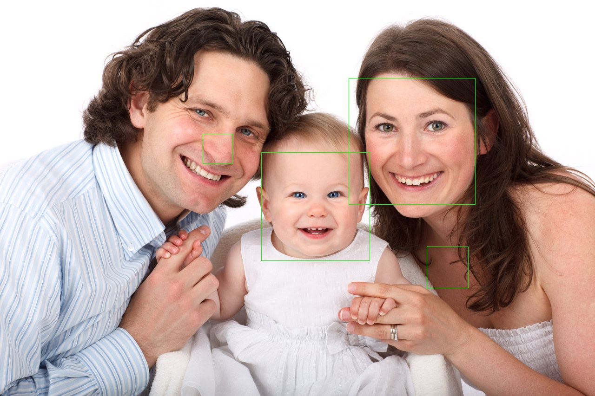

# Distributed Image Processing in Cloud Dataproc

The purpose of this project is to use a distributed computing platform and perform a task suited to the platform. For this project, I did a face detection task using GCP Dataproc. Essentially, after uploading images to a bucket, this enables face detection of those images and outputs an image where faces are outlined. 

Reference Lab: [Distributed Image Processing in Cloud Dataproc](https://www.qwiklabs.com/focuses/5834?catalog_rank=%7B%22rank%22%3A7%2C%22num_filters%22%3A0%2C%22has_search%22%3Atrue%7D&parent=catalog&search_id=4914974)

## Example

#### Input Image


#### Output Image


## Directions

### A. Create a development machine in Compute Engine
1. Compute Engine > VM Instances > Create
2. Set the following settings then click `Create`
- Name: devhost
- Series: N1
- Machine Type: 2 vCPUs (n1-standard-2 instance)
- Identity and API Access: Allow full access to all Cloud APIs.

### B. Install Software
1. Set up Scala and sbt
```
sudo apt-get install -y dirmngr unzip
sudo apt-get update
sudo apt-get install -y apt-transport-https
echo "deb https://dl.bintray.com/sbt/debian /" | \
sudo tee -a /etc/apt/sources.list.d/sbt.list
sudo apt-key adv --keyserver hkp://keyserver.ubuntu.com:80 --recv 642AC823
sudo apt-get update
sudo apt-get install -y bc scala sbt
```
2. Set up the Feature Detector Files
```
sudo apt-get update
gsutil cp gs://spls/gsp124/cloud-dataproc.zip .
unzip cloud-dataproc.zip
cd cloud-dataproc/codelabs/opencv-haarcascade
```
3. Launch build
`sbt assembly`

### C. Create a Cloud Storage bucket and collect images
1. Setup bucket
```
GCP_PROJECT=$(gcloud config get-value core/project)
MYBUCKET="${USER//google}-image-${RANDOM}"
echo MYBUCKET=${MYBUCKET}
```
2. Create bucket
`gsutil mb gs://${MYBUCKET}`
3. Download sample images
```
curl https://www.publicdomainpictures.net/pictures/20000/velka/family-of-three-871290963799xUk.jpg | gsutil cp - gs://${MYBUCKET}/imgs/family-of-three.jpg
curl https://www.publicdomainpictures.net/pictures/10000/velka/african-woman-331287912508yqXc.jpg | gsutil cp - gs://${MYBUCKET}/imgs/african-woman.jpg
curl https://www.publicdomainpictures.net/pictures/10000/velka/296-1246658839vCW7.jpg | gsutil cp - gs://${MYBUCKET}/imgs/classroom.jpg
```
4. Check bucket contents
`gsutil ls -R gs://${MYBUCKET}`
Example output:
```
gs://gcpstaging20392-student-image-23218/imgs/:
gs://gcpstaging20392-student-image-23218/imgs/african-woman.jpg
gs://gcpstaging20392-student-image-23218/imgs/classroom.jpg
gs://gcpstaging20392-student-image-23218/imgs/family-of-three.jpg
```

### D. Create a Cloud Dataproc cluster
1. Setup cluster
```
MYCLUSTER="${USER/_/-}-qwiklab"
echo MYCLUSTER=${MYCLUSTER}
```

2. Create cluster
```
gcloud config set dataproc/region us-central1
gcloud dataproc clusters create ${MYCLUSTER} --bucket=${MYBUCKET} --worker-machine-type=n1-standard-2 --master-machine-type=n1-standard-2 --initialization-actions=gs://spls/gsp010/install-libgtk.sh --image-version=2.0  
```

### E. Submit Job to Dataproc
1. Load face detection configuration to bucket
`curl https://raw.githubusercontent.com/opencv/opencv/master/data/haarcascades/haarcascade_frontalface_default.xml | gsutil cp - gs://${MYBUCKET}/haarcascade_frontalface_default.xml`
2. Submit job to Dataproc
```
cd ~/cloud-dataproc/codelabs/opencv-haarcascade
gcloud dataproc jobs submit spark \
--cluster ${MYCLUSTER} \
--jar target/scala-2.12/feature_detector-assembly-1.0.jar -- \
gs://${MYBUCKET}/haarcascade_frontalface_default.xml \
gs://${MYBUCKET}/imgs/ \
gs://${MYBUCKET}/out/
```
3. Check the status of job by going to Navigation menu > Dataproc > Jobs. Once it says `succeeded`, you may check the output images.
4. Go to Navigation menu > Storage then click on your bucket. In the `out` folder, you can download the output images.
